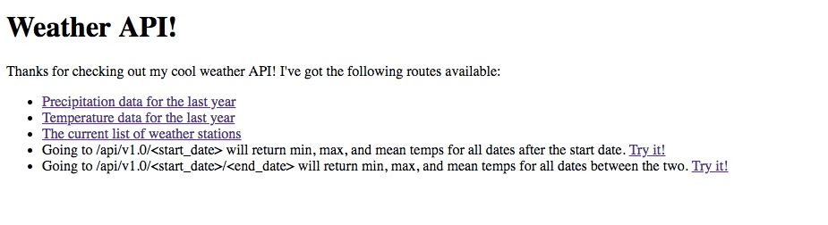

# Tutoring Example: Creating a Hawaii Data API

Clean some data from a CSV, generate a Sqlite3 database from it, and host it via an API.  This was done as an example while tutoring.

## To Test Locally

Clone the repository.

    git clone https://github.com/rpalo/tutoring-hawaii-example.git

This repo uses [Pipenv](https://github.com/pypa/pipenv) to manage dependencies.  If you don't have it yet, install it.

    pip install pipenv

Move into the repository

    cd tutoring-hawaii-example

Activate the environment

    pipenv shell

Install the dependencies

    pipenv install

To check out the Jupyter notebooks:

    jupyter notebook

To check out the API:

    python app.py

